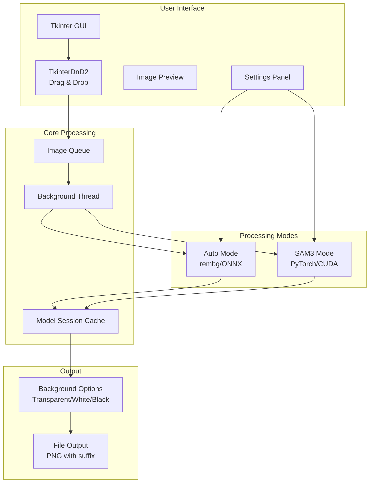
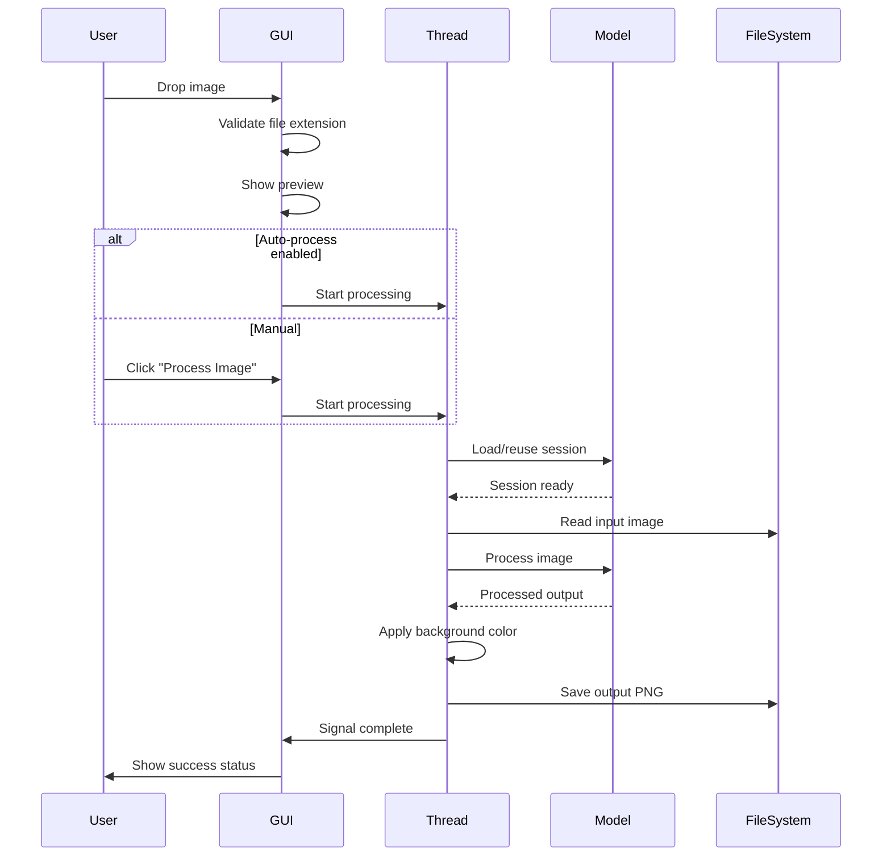
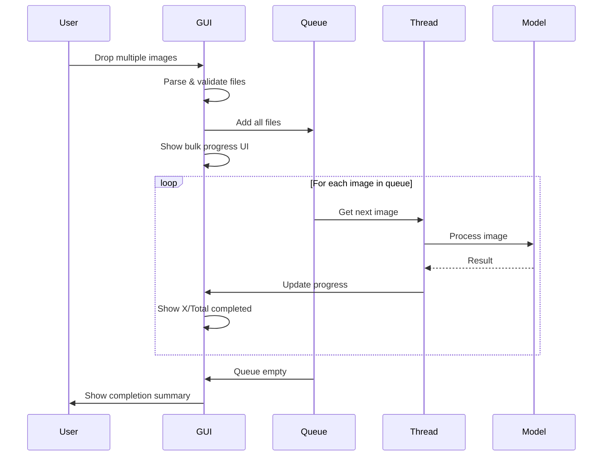
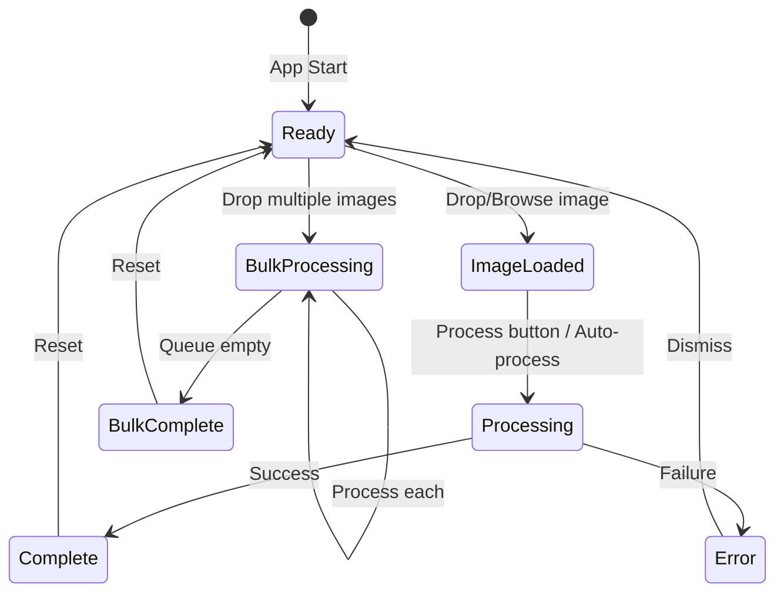
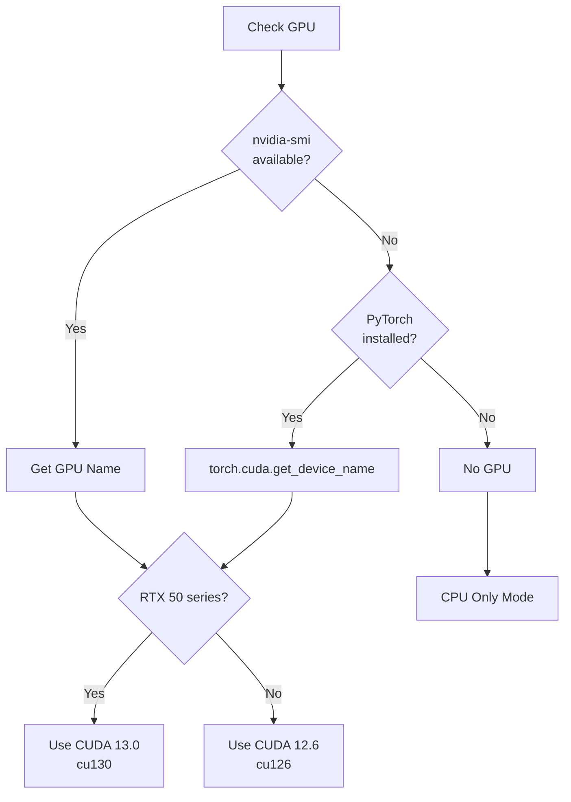
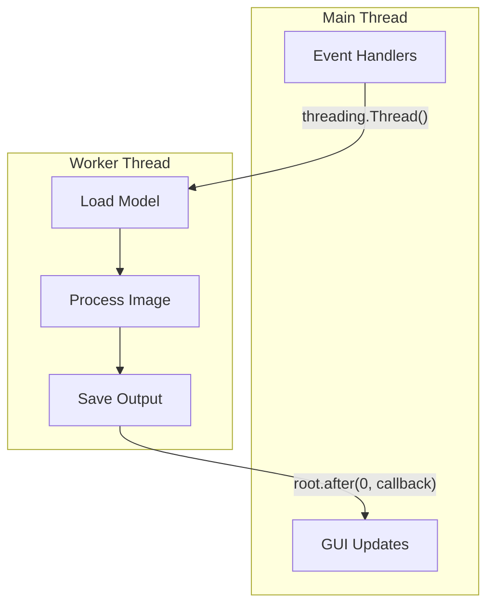
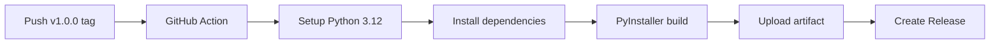

# BrainDead Background Remover - Architecture & Developer Guide

## Overview

BrainDead Background Remover is a portable, drag-and-drop GUI application for AI-powered background removal. It supports two processing modes and bulk image processing.

## Technology Stack

| Component | Technology | Purpose |
|-----------|------------|---------|
| GUI Framework | Tkinter + TkinterDnD2 | Native cross-platform GUI with drag-and-drop |
| AI Backend (Auto) | rembg + ONNX Runtime | CPU-based background removal |
| AI Backend (SAM3) | SAM3 + PyTorch | GPU-accelerated text-based segmentation |
| Image Processing | Pillow (PIL) | Image loading, manipulation, saving |
| Packaging | PyInstaller | Single-file executable creation |

## Architecture Diagram



## Processing Flow

### Single Image Processing



### Bulk Processing Flow



## Module Structure

```
bg_remover.py
├── Imports & Constants
│   ├── REMBG_MODELS - Available AI models
│   ├── SUFFIX_OPTIONS - Output filename suffixes
│   └── BACKGROUND_OPTIONS - Background color choices
│
├── Utility Functions
│   ├── check_nvidia_gpu() - Detect GPU hardware
│   ├── get_recommended_cuda_version() - Auto-select PyTorch version
│   ├── get_config_path() - Config file location
│   ├── load_config() / save_config() - Settings persistence
│   └── get_python_executable() - Find Python for installations
│
└── BackgroundRemoverApp (Main Class)
    ├── __init__() - Initialize app state
    ├── setup_ui() - Build GUI components
    │
    ├── Drag & Drop Handlers
    │   ├── on_drop() - Handle dropped files
    │   ├── on_drag_enter/leave() - Visual feedback
    │   └── browse_file() - File dialog
    │
    ├── Image Loading
    │   ├── load_image() - Single image load + preview
    │   └── start_bulk_processing() - Queue multiple images
    │
    ├── Processing Pipeline
    │   ├── process_current_image() - Start single processing
    │   ├── _process_image_thread() - Background worker
    │   ├── _process_with_rembg() - Auto mode processing
    │   └── _process_with_sam3() - SAM3 mode processing
    │
    ├── Bulk Processing
    │   ├── _process_next_in_queue() - Queue manager
    │   ├── _process_bulk_image_thread() - Bulk worker
    │   ├── _on_bulk_item_complete() - Per-item callback
    │   └── _on_bulk_complete() - Final summary
    │
    ├── Settings Management
    │   ├── on_mode_change() - Switch Auto/SAM3
    │   ├── on_model_change() - Change rembg model
    │   ├── on_setting_change() - Generic setting update
    │   └── save_current_config() - Persist settings
    │
    └── SAM3 Installation
        ├── show_sam3_install_dialog() - GPU check dialog
        └── run_sam3_installation() - Generate install script
```

## State Management

### Application State



### Key State Variables

| Variable | Type | Purpose |
|----------|------|---------|
| `processing` | bool | Single image being processed |
| `bulk_processing` | bool | Bulk operation in progress |
| `current_image_path` | str | Path to current/last image |
| `image_queue` | list | Queue for bulk processing |
| `rembg_session` | Session | Cached rembg model session |
| `sam3_model` | Model | Cached SAM3 model |
| `config` | dict | User settings |

## Configuration

Settings are persisted in `bg_remover_config.json`:

```json
{
  "model": "birefnet-general",
  "suffix": "_nobg",
  "background": "transparent",
  "alpha_matting": false,
  "alpha_matting_fg_threshold": 240,
  "alpha_matting_bg_threshold": 10,
  "alpha_matting_erode_size": 10,
  "auto_process": true,
  "use_sam3": false,
  "sam3_prompt": "",
  "sam3_keep_subject": true
}
```

## GPU Detection & CUDA Selection



## SAM3 Installation Flow


## Threading Model

All image processing runs in background threads to keep the UI responsive:



### Thread Safety

- UI updates use `root.after(0, callback)` to marshal to main thread
- Model sessions are cached and reused (not thread-safe, but single worker)
- Bulk processing is sequential (one image at a time)

## Error Handling

| Error Type | Handling |
|------------|----------|
| Invalid file format | Show error in status, reject |
| Model loading failure | Show error, allow retry |
| Processing failure | Show error, continue bulk queue |
| SAM3 not installed | Show install button |
| GPU not available | Disable SAM3 mode |

## Extending the Application

### Adding a New AI Model

1. Add to `REMBG_MODELS` dictionary
2. Model must be compatible with rembg's `new_session()`

### Adding a New Background Option

1. Add to `BACKGROUND_OPTIONS` dictionary
2. Format: `"key": ("Display Name", (R, G, B))` or `None` for transparent

### Adding a New Output Format

1. Modify `_process_with_rembg()` and `_process_with_sam3()`
2. Update file saving logic
3. Add config option

## Build System

### Development Run

```bash
run.bat  # Creates venv, installs deps, runs app
```

### Build Executable

```bash
build.bat       # CPU-only, lightweight (~50MB)
build_full.bat  # With SAM3/PyTorch (~2-3GB)
```

### GitHub Actions

Automated builds trigger on version tags (`v*`):



## File Structure

```
BrainDeadBackgroundRemover/
├── bg_remover.py           # Main application
├── requirements.txt        # CPU dependencies
├── requirements-sam3.txt   # GPU dependencies (optional)
├── run.bat                 # Development runner
├── build.bat               # Build script (lightweight)
├── build_full.bat          # Build script (with SAM3)
├── README.md               # User documentation
├── ARCHITECTURE.md         # This file
├── .github/
│   └── workflows/
│       └── build.yml       # CI/CD workflow
└── .gitignore
```

## Performance Considerations

1. **Model Caching**: Sessions are cached to avoid reloading on each image
2. **Background Threading**: UI remains responsive during processing
3. **Sequential Bulk**: One image at a time prevents memory issues
4. **Lazy Loading**: SAM3 model only loads when first used

## Known Limitations

1. SAM3 requires NVIDIA GPU with CUDA support
2. RTX 50 series (Blackwell) requires CUDA 13.0+
3. Large images may be slow with alpha matting enabled
4. Triton has limited Windows support (may show warnings)
