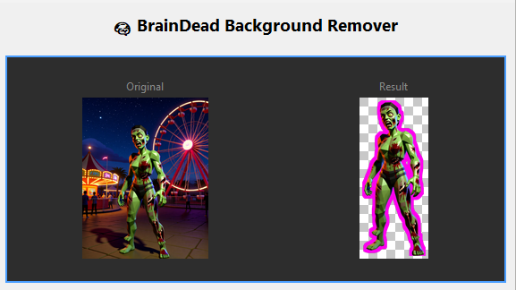
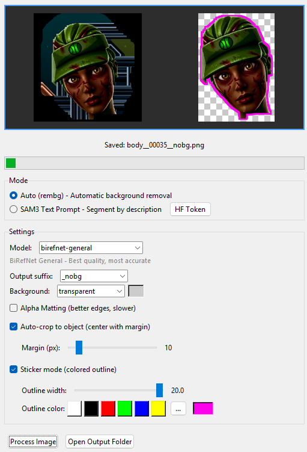
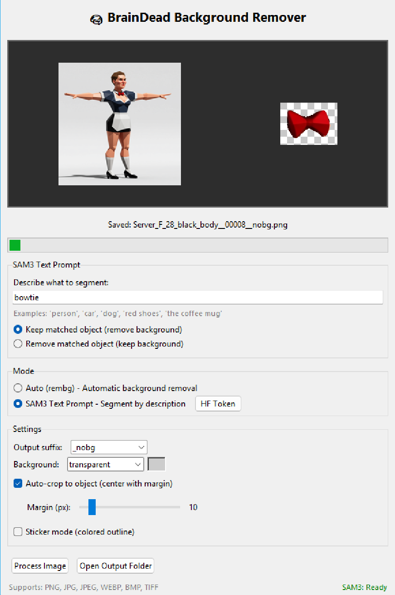

# 🧠BrainDead Background Remover

**Tired of opening Photoshop or ComfyUI just to remove a background?** We were too.

BrainDead Background Remover is a free, lightweight tool that does one thing really well: removes backgrounds from images. Drop your files, get transparent PNGs. That's it.


[](https://github.com/BizaNator/BrainDeadBackgroundRemover/releases/latest)

**🧠 BrainDeadGuild**

*Don't Be BrAIn Dead Alone*

*Games | AI | Community*

[](https://braindeadguild.com/Discord) [](https://braindead.tv/)

## 🎯 About BrainDeadGuild

**BrainDeadGuild** started in 2008 as a gaming community and evolved into a collaboration of gamers, streamers, AI creators, and game developers. We're focused on:

- 🎮 **Game Development** — UEFN / Fortnite projects
- 🧠 **AI-Assisted Creation** — tools and workflows
- 📺 **BrainDead.TV** — shared lore, characters, and worlds (including the City of Brains universe)

The tools we release (like this one) are built for our own game and content pipelines, then shared openly when they're useful to others.


## Quick Start

1. **Download** the exe from [Releases](https://github.com/BizaNator/BrainDeadBackgroundRemover/releases/latest)
2. **Drop** your image(s) onto the window
3. **Done** - transparent PNGs saved next to your originals

No installation. No account. No internet required after first run.

## Why This Tool?

- **No subscriptions** - Free forever, no watermarks, no limits
- **Works offline** - Models download once, then work without internet
- **Bulk processing** - Drop 100 images, get 100 transparent PNGs
- **Portable** - Single exe, no installer, runs from USB drive
- **Privacy first** - Everything runs locally, your images never leave your computer

**Perfect for:** Product photography, social media content, sticker makers, game asset creation, profile pictures, e-commerce listings, or anyone who just needs backgrounds gone fast.

## Features

- **Drag & Drop**: Drop single or multiple images for batch processing
- **Bulk Processing**: Select multiple images at once for batch background removal
- **Multiple AI Models**: BiRefNet, U2Net, ISNet, SAM (14 models)
- **SAM3 Text Prompts**: Optional text-based segmentation ("remove the dog", "keep the car")
- **Alpha Matting**: Better edge quality with adjustable thresholds
- **Auto-crop**: Automatically crop output to subject with adjustable margin
- **Sticker Mode**: Add colored outline/stroke around subjects for sticker effect
- **Background Options**: Transparent, white, or black backgrounds
- **Portable**: No installer needed, single executable
- **CPU-Only by Default**: No GPU required for standard mode
- **Auto-save**: Outputs to same folder as input with configurable suffix
- **Settings Persistence**: Remembers your preferences



*Sticker Mode adds a colored outline around your subject - perfect for die-cut stickers, social media, or making subjects pop!*

## Two Modes

### Auto Mode (Default) - CPU Only
Uses rembg with ONNX Runtime. No PyTorch or CUDA required. Works on any machine - just download the exe and go!

### SAM3 Mode (Optional) - GPU Required
Text-based segmentation using Meta's SAM3. Describe what to segment:
- "person" / "the dog" / "red car"
- Choose to keep or remove the matched object



**SAM3 Requirements**:
- Python 3.12+, PyTorch 2.7+, CUDA 12.6+, NVIDIA GPU
- **Hugging Face account** with access to the gated SAM3 model (free)

## Supported Models (Auto Mode)

| Model | Description |
|-------|-------------|
| birefnet-general | Best quality, most accurate (recommended) |
| birefnet-general-lite | Faster, good quality |
| birefnet-portrait | Optimized for faces/portraits |
| birefnet-dis | Dichotomous segmentation |
| birefnet-hrsod | High-resolution salient objects |
| birefnet-cod | Concealed object detection |
| birefnet-massive | Large dataset trained |
| u2net | Classic model, balanced |
| u2netp | Lightweight, fast |
| u2net_human_seg | Human segmentation |
| u2net_cloth_seg | Clothing segmentation |
| isnet-general-use | Good all-around |
| isnet-anime | Anime/illustration optimized |
| sam | Segment Anything Model |

## Installation

### Option 1: Download Pre-built Executable (Easiest)

Download `BrainDeadBGRemover.exe` from the [Releases](https://github.com/BizaNator/BrainDeadBackgroundRemover/releases) page.

> **Note**: The pre-built exe only supports **Auto Mode (CPU)**. For SAM3 GPU support, use Option 2 below.

### Option 2: Run from Source (For SAM3/GPU Support)

This is the recommended approach if you want SAM3 text-based segmentation with GPU acceleration.

1. Clone or download this repository
2. Double-click `run.bat` - it automatically:
   - Creates an isolated virtual environment
   - Installs all dependencies (first run only)
   - Launches the application

3. Click "Install SAM3" button in the app to add GPU support

Your system Python packages are never touched.

### Option 3: Build Your Own Executable

Double-click `build.bat` to create a CPU-only portable exe (~50MB).

For a full build with SAM3 bundled (~2-3GB), use `build_full.bat`.

```bash
# Or manually with your own venv:
python -m venv build_env
build_env\Scripts\activate
pip install -r requirements.txt pyinstaller
pyinstaller --onefile --windowed --name BrainDeadBGRemover \
    --hidden-import rembg \
    --collect-all rembg \
    --collect-data tkinterdnd2 \
    bg_remover.py
```

### Enabling SAM3 Mode

SAM3 is a "gated" model on Hugging Face, meaning you need to request access before using it.

#### Step 1: Get Hugging Face Access
1. Create a free account at [huggingface.co](https://huggingface.co)
2. Visit [huggingface.co/facebook/sam3](https://huggingface.co/facebook/sam3) and request access
3. Create an access token at [huggingface.co/settings/tokens](https://huggingface.co/settings/tokens)

#### Step 2: Install SAM3
If you have an NVIDIA GPU and are running from source (Option 2):
1. Click the "Install SAM3" button in the app
2. Paste your Hugging Face token when prompted
3. The installer auto-detects your GPU and installs the correct PyTorch version:
   - **RTX 50 series** (5090, 5080, 5070): Uses CUDA 13.0 (cu130)
   - **RTX 40/30/20 and older**: Uses CUDA 12.6 (cu126)

#### Manual Installation
```bash
# Login to Hugging Face first:
huggingface-cli login

# RTX 50 series (Blackwell):
pip install torch torchvision --index-url https://download.pytorch.org/whl/cu130
pip install sam3 psutil huggingface_hub

# RTX 40/30/20 and older:
pip install torch torchvision --index-url https://download.pytorch.org/whl/cu126
pip install sam3 psutil huggingface_hub

# Download required assets (SAM3 package bug workaround):
python -c "import os, urllib.request; d=os.path.join(os.path.dirname(__import__('sam3').__file__),'..','assets'); os.makedirs(d,exist_ok=True); urllib.request.urlretrieve('https://raw.githubusercontent.com/openai/CLIP/main/clip/bpe_simple_vocab_16e6.txt.gz',os.path.join(d,'bpe_simple_vocab_16e6.txt.gz'))"
```

## Usage

1. Launch the application
2. Select mode: **Auto** (rembg) or **SAM3** (text prompt)
3. Drop image(s) onto the window (or click to browse)
   - Single image: Preview and process
   - Multiple images: Bulk processing with progress display
4. For SAM3: Enter what to segment (e.g., "person", "the coffee mug")
5. Background is automatically removed
6. Output saved to same folder as input with suffix (e.g., `image_nobg.png`)

### Settings

- **Mode**: Auto (rembg) or SAM3 (text-based)
- **Model**: Choose the AI model for removal (Auto mode)
- **Text Prompt**: Describe what to segment (SAM3 mode)
- **Keep/Remove**: Keep matched object or remove it (SAM3 mode)
- **Output suffix**: Customize the output filename suffix
- **Background**: Transparent, white, or black
- **Alpha Matting**: Enable for better edge quality (slower, Auto mode only)
- **Auto-crop**: Crop output to subject bounding box with adjustable margin (0-100px)
- **Sticker Mode**: Add colored outline around the subject
  - Outline width: 1-20 pixels
  - Color presets: White, Black, Red, Green, Blue, Yellow
  - Custom color picker for any color

## Supported Formats

- Input: PNG, JPG, JPEG, WEBP, BMP, TIFF
- Output: PNG (with transparency or solid background)

## Notes

- First run downloads the selected AI model (~170MB for BiRefNet)
- Models are cached in `~/.u2net/`
- Settings saved in `bg_remover_config.json` next to executable
- SAM3 requires significant GPU memory (~4GB+ VRAM recommended)
- Pre-built exe is CPU-only; use `run.bat` for SAM3/GPU support

## Requirements

**Auto Mode (CPU) - Pre-built exe or run.bat:**
- Windows 10/11
- No GPU required

**Auto Mode from Source:**
- Python 3.10+
- Windows/Linux/macOS
- No GPU required

**SAM3 Mode (GPU) - run.bat only:**
- Python 3.12+
- NVIDIA GPU with CUDA support
  - RTX 50 series: CUDA 13.0+ (auto-detected)
  - RTX 40/30/20 and older: CUDA 12.6+
- PyTorch 2.7+
- ~4GB+ VRAM

## Troubleshooting

### SAM3 "403 Access Denied" or "Gated Repo" Error
This means you don't have access to the SAM3 model:
1. Go to [huggingface.co/facebook/sam3](https://huggingface.co/facebook/sam3)
2. Click "Request Access" (you need a free Hugging Face account)
3. Wait for approval (usually instant)
4. Click "HF Token" button in the app to enter your token
5. Restart the app

### SAM3 "No such file: bpe_simple_vocab_16e6.txt.gz"
Run this command to download the missing file:
```bash
python -c "import os, urllib.request; d=os.path.join(os.path.dirname(__import__('sam3').__file__),'..','assets'); os.makedirs(d,exist_ok=True); urllib.request.urlretrieve('https://raw.githubusercontent.com/openai/CLIP/main/clip/bpe_simple_vocab_16e6.txt.gz',os.path.join(d,'bpe_simple_vocab_16e6.txt.gz'))"
```

### GPU Not Detected
- Ensure you have NVIDIA drivers installed
- The app checks `C:\Windows\System32\nvidia-smi.exe` and common paths

## License (Code)

The application source code in this repository is licensed under the **GNU General Public License, version 3 or later (GPL-3.0-or-later)**. See the [LICENSE](LICENSE) file for full terms.

This means you are free to use, modify, and distribute this software, but any derivative works must also be released under the GPL-3.0 license with source code available.

## Models and Third-Party Licenses

This application downloads and uses third-party AI models which are **not** covered by this repository's GPL-3.0 license. Each model remains under its original license:

| Model Family | Source | License |
|--------------|--------|---------|
| BiRefNet | [rembg](https://github.com/danielgatis/rembg) | MIT (wrapper), model weights vary |
| U2Net, ISNet | [rembg](https://github.com/danielgatis/rembg) | Apache 2.0 / MIT |
| SAM3 | [facebook/sam3](https://huggingface.co/facebook/sam3) | Meta License (gated, requires approval) |

**Important**: To use SAM3, you must agree to Meta's license terms on Hugging Face. Some models may have non-commercial or other usage restrictions. Please review each model's license before use in commercial applications.

See [MODELS.md](MODELS.md) for detailed information about third-party models and their licenses.

---

## Community & Support

**🧠Don't Be BrAIn Dead Alone!**

[](https://BrainDeadGuild.com/Discord)
[](https://BrainDeadGuild.com)

- **Discord**: [BrainDeadGuild.com/Discord](https://BrainDeadGuild.com/Discord) - Get help, share creations, suggest features
- **Website**: [BrainDeadGuild.com](https://BrainDeadGuild.com)
- **Lore & Content**: [BrainDead.TV](https://BrainDead.TV)
- **GitHub**: [github.com/BrainDeadGuild](https://github.com/BrainDeadGuild)

### Other BrainDead Tools

Check out our other free tools for creators:

| Tool | Description |
|------|-------------|
| [ComfyUI-BrainDead](https://github.com/BizaNator/ComfyUI-BrainDead) | Custom nodes for ComfyUI - character consistency, prompt tools, and more |
| [BrainDeadBlender](https://github.com/BizaNator/BrainDeadBlender) | Blender add-ons for 3D artists and game developers |

---

*A [Biloxi Studios Inc.](https://BrainDeadGuild.com) Production*
